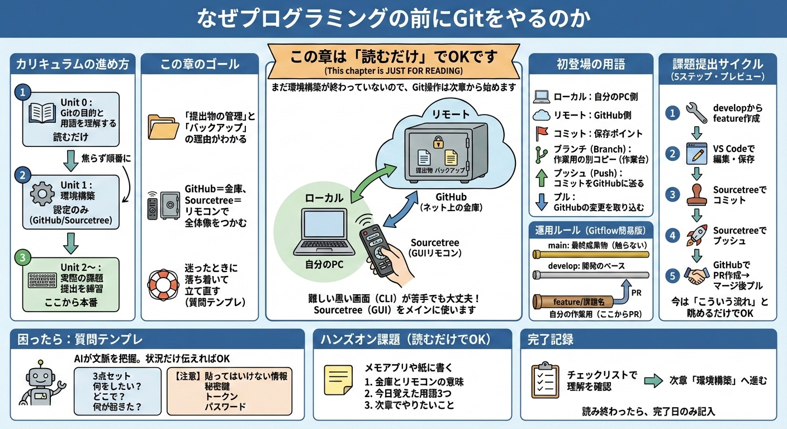

# なぜプログラミングの前にGitをやるのか



> **この章は「読むだけ」でOKです。** まだ環境構築が終わっていないので、Git操作は次章から始めます。

## このカリキュラムの進め方
このカリキュラムは、以下の順番で進めます。

| 順番 | 章 | 内容 | Git操作 |
|------|-----|------|---------|
| 1 | **この章（Unit 0）** | Gitの目的と用語を理解する | なし（読むだけ） |
| 2 | Unit 1 | 環境構築（GitHub/Sourcetree） | 設定のみ |
| 3 | Unit 2〜 | 実際の課題提出を練習 | ここから本番 |

**ポイント**：焦らず順番に進めましょう。この章を読み終わったら、次の「環境構築」でGitHubとSourcetreeをセットアップします。

---

## 1. この章のゴール
- 「提出物の管理」と「バックアップ」のために Git/GitHub を使う理由がわかる。
- GitHub＝ネット上の金庫、Sourcetree＝金庫を操作するリモコン、で全体像をつかむ。
- 迷ったときに落ち着いて立て直す（質問テンプレ）を身につける。

## 2. 概念の説明
プログラミングの学習は、最初は「動かない」「壊れた」「どこを直したらいいか分からない」が普通に起きます。  
Git を先に学ぶと、次の2つが一気にラクになります。

- **提出物の管理**：課題の「途中経過」と「完成形」を、間違えずに提出できる
- **バックアップ**：PC が壊れても GitHub（ネット上）に課題が残る

そして、難しい黒い画面（CLI）が苦手でも大丈夫です。  
このカリキュラムでは Sourcetree（GUI）をメインに使います。

### たとえ話（超重要）
- **GitHub**：ネット上の金庫（提出先＋バックアップ）
- **Sourcetree**：金庫を操作するリモコン（クリックで操作できる）

### 初登場の用語（最小セット）
- **ローカル**：自分の PC 側。**リモート**：GitHub 側。
- **コミット**：保存ポイント（あとで戻れる地点）。
- **ブランチ**：作業用の別コピー（安全に試すための作業台）。
- **プッシュ**：コミットを GitHub に送ること。
- **プル**：GitHub の変更を自分の PC に取り込むこと。

## 3. 全てのカリキュラムの運用ルール（Gitflow 簡易版）
運用ルールがあると「提出ミス」が減ります。ここでは次の3本だけ使います。

- `main`：最終成果物（基本は触らない）
- `develop`：開発のベース（課題を統合する枝）
- `feature/課題名`：自分の作業用（ここから PR を出す）

## 4. 課題提出サイクル（最短の5ステップ）〜プレビュー〜
この5ステップが、この先ずっとの「型」になります。**今は「こういう流れなんだな」と眺めるだけでOKです。**

1. `develop` から `feature/task1` を作る（作業台を作る）
2. お使いのエディタ（例：VS Code）で編集して保存する
3. Sourcetree で「ステージング → コミット」（保存ポイントを作る）
4. Sourcetree で「プッシュ」（金庫に送る）
5. GitHub で `feature` → `develop` の PR を作る → マージ後にローカル `develop` をプルで更新

> **いつ練習するの？**
> - Unit 1 で環境構築が終わった後
> - Unit 2「Gitflowによる課題提出サイクル」で、実際に手を動かして練習します
>
> 今は覚えなくて大丈夫。まずは「5ステップある」ことだけ頭に入れておいてください。

## 5. 困ったら：質問テンプレ（そのまま使ってOK）
このカリキュラムは「今開いているページの内容」を AI が自動で把握しています。
なので、**状況だけ伝えれば**すぐに的確な回答が返ってきます。

1. まず「3点セット」で状況を書きます（これができると解決が一気に早くなります）。
   - 何をしたい？（例：`develop` から `feature/task1` を作りたい）
   - どこで？（例：Sourcetree の `Branch` ボタン、GitHub の PR 画面）
   - 何が起きた？（例：エラー文、画面に出ているメッセージ）
2. 画面に出ている文字を、そのまま書けばOKです（コピーできるならコピー／できなければ書き写す）
3. 【注意】貼ってはいけない情報（絶対に共有しない）:
   - 秘密鍵（`id_ed25519` など）の中身
   - アクセストークン、パスワード、個人情報

**コピペ用テンプレ**
```md
分からない用語：（例）コミット、ブランチ
質問：（例）「ブランチ」を小学生にも分かる言葉で説明してほしい
```

**補足**：この章ではまだGit操作をしないので、上記のシンプルなテンプレでOKです。
環境構築後（Unit 1以降）は、エラーが出たときに以下の詳細テンプレを使います。

```md
目的：（例）developからfeature/task1を作ってPR提出したい
今いるブランチ：（Sourcetreeで太字/チェックのブランチ名）
どこで詰まった：Sourcetree / GitHub / エディタ
直前に押したボタン：1)  2)  3)
起きていること：（例）Pushで認証エラー
エラー全文：（画面に出たメッセージをそのまま）
※秘密鍵・トークン・パスワードは貼りません
```

## 6. よくあるミス・つまずきポイント
- エラー文を省略してしまい、原因が特定できない（まず全文を貼る）。
- Fetch / Pull / Push などの言葉を混同して不安になる（次章から丁寧に説明します）。

## 7. AIに聞いてみよう（質問例）
AI はこのページの文脈を見たうえで答えられるので、**「この章のどのステップの話か」**を含めて聞くと最短です。  
返答は「クリック場所」と「次にやること」を箇条書きでお願いすると迷いません。

```text
「この章の “課題提出サイクル（5ステップ）” を、Sourcetreeで押すボタン名だけで短くまとめて」
「私は今、5ステップのどこで止まってる？次にやることを1つだけ教えて（状況：___）」
「GitHub＝金庫／Sourcetree＝リモコンのたとえで、commit/push/PRを1文ずつ説明して」
```

## 8. ハンズオン課題（この章は読むだけでOK）
まだ環境構築が終わっていないので、**この章ではGit操作は不要です**。
読んでいて「なんだこれ？」と思ったことがあれば、遠慮なくAIに質問してください。

**質問例**
```text
「GitHub＝金庫、Sourcetree＝リモコンって書いてあるけど、もっと詳しく教えて」
「コミットとプッシュの違いがよく分からない。具体例で説明して」
「ブランチって何のためにあるの？使わないとどうなる？」
```

疑問をその場で解消しながら進めるのが、一番効率の良い学習方法です。

## 9. チェックリスト（理解確認）
- [ ] 「何をしたい／どこで／何が起きた」を書ける。
- [ ] “貼ってはいけない情報”（秘密鍵など）を説明できる。
- [ ] 分からない用語を AI に噛み砕かせる質問ができる。

---

## 完了記録

この章には提出課題はありません（まだ環境構築前のため）。

**やること**
- 分からないことがあればAIに質問して理解を深める
- チェックリストで理解を確認する
- 次章「環境構築」へ進む

読み終わったら、スプレッドシートに **完了日** のみ記入してください。
