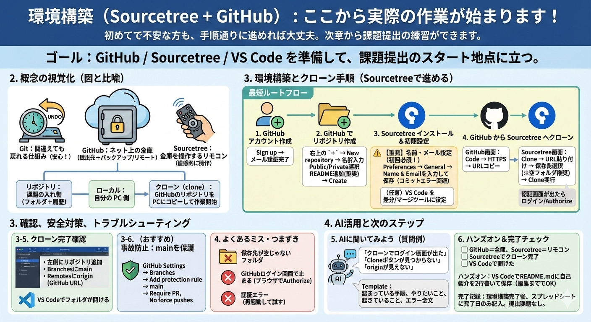

# 環境構築（Sourcetree + GitHub）



> **ここから実際の作業が始まります！** この章で環境を整えれば、次章から課題提出の練習ができます。
> 初めてで不安な方も、手順通りに進めれば大丈夫です。

## 1. この章のゴール
- GitHub / Sourcetree / エディタを準備して、課題提出のスタート地点に立てる。
- GitHub アカウントを作り、Sourcetree を使ってリポジトリをクローンできる。

## 2. 概念の説明
- まず安心してほしいこと：Git は「間違えても戻れる仕組み」です。最初に覚えると、その後の課題がずっと楽になります。
- GitHub は「ネット上の金庫」（提出先＋バックアップ）、Sourcetree は「金庫を操作するリモコン」です。

### 初登場の用語（ここだけ押さえればOK）
- **リポジトリ**：課題の入れ物（フォルダ＋履歴）。
- **ローカル**：自分の PC 側。**リモート**：GitHub 側。
- **クローン（clone）**：GitHub のリポジトリを自分の PC にコピーして、作業できる状態にすること。

## 3. 環境構築とクローン手順（Sourcetree）
この章では「黒い画面（CLI）」をできるだけ使わず、Sourcetree で進めます。

### この章の最短ルート（迷ったらここに戻る）
1. GitHub アカウントを作る
2. GitHub でリポジトリを作る
3. Sourcetree を入れる
4. GitHub の URL でクローンする（HTTPS が簡単でおすすめ）

### 3-1. GitHub アカウント作成
- GitHub にアクセス → `Sign up`（登録）
- メール認証まで完了させる

### 3-2. GitHub でリポジトリを作成
- GitHub 右上の `+` → `New repository`
- `Repository name`：例 `git-learning`
- `Public` に設定してください
- `Add a README file` を **必ず ON** にしてください
- `Create repository`

### 3-3. Sourcetree のインストールと初期設定
- Sourcetree をインストールして起動
- 初回セットアップは、分からない項目は無理に触らず進めて OK（後から変更できます）

### 3-3.5 【重要】コミットに必要な「名前・メール」を設定する（初回だけ）
初回にここを飛ばすと、コミット時にエラーが出て止まりやすいです。先に設定しておくのが最強です。

- Sourcetree → `Preferences` / `Options`（設定）を開く
- `General`（一般）などのタブで `Default user information`（ユーザー情報）を探す
- 次を入力して保存
  - `Name`：あなたの名前（本名でもハンドルネームでもOK。履歴に残ります）
  - `Email`：GitHub に登録しているメール（または GitHub の no-reply メールでもOK）

### 3-3.6 （おすすめ）お使いのエディタを差分/マージツールに設定する
コンフリクト解決（第6章）で、エディタが開くようにしておくと安心です。

- Sourcetree → `Preferences` / `Options`
- `Diff` / `Merge` の項目を探す
- `External Diff Tool` / `External Merge Tool` にお使いのエディタ（例：VS Code）を選ぶ（選べない場合はスキップでOK）

### 3-4. GitHub リポジトリを Sourcetree にクローンする
- GitHub のリポジトリ画面で `Code` → `HTTPS` を選ぶ → URL をコピー（`https://github.com/...` の形）
- Sourcetree で `Clone` をクリック
- `Source Path / URL` に貼り付け
- `Destination Path`（保存先）を選ぶ（できれば **空のフォルダ**。既にファイルがある場合は避ける）
- `Clone` をクリック

※ `Clone` が見当たらないときは、`File` → `Clone/New...` を探してください（表示名は環境で少し違います）。

> **認証について**
> - 初回は GitHub のログイン画面が出ることがあります。画面の指示に従ってログインすれば OK です。
> - Sourcetree が「GitHub にログイン」を求めてきたら、`Authorize` を押して許可します。

### 3-5. クローンできたか確認（ここで迷う人が多い）
- Sourcetree でリポジトリが左側に追加されている
- 左のブランチ一覧に `main`（または `master`）が見える
- 左の `Remotes` に `origin` があり、GitHub の URL が設定されている
- お使いのエディタ（例：VS Code）でフォルダを開ける
  - Sourcetree のメニューから `Open in Finder/Explorer` や `Open in External Editor` を探す（表示名は環境で異なります）
確認のコツ：
- Sourcetree 左側に「リポジトリ一覧」が出ていればOK（見えない場合は、画面左のサイドバーを広げてみてください）
- そのリポジトリを選ぶと、左側に `Branches` と `Remotes` が出ます（`origin` があれば GitHub とつながっています）

### 3-6. （おすすめ）事故を防ぐ：GitHubで main を保護する
初心者が一番やりがちな事故は「`main` に直接 push してしまう」です。GitHub 側で “ガード” を付けると安心です。

- GitHub のリポジトリ → `Settings`
- `Branches` → `Add branch protection rule`
- `Branch name pattern` に `main`
- `Require a pull request before merging` を ON
- `Do not allow force pushes` があれば ON

※ `Settings` が見えない場合は権限がない可能性があります。そのときはスキップして OK です。

## 4. よくあるミス・つまずきポイント
- クローン先のフォルダに既にファイルがある → 空のフォルダを指定する
- GitHub のログイン画面で止まる → ブラウザでログインして `Authorize` を押す
- 認証エラーが出る → Sourcetree を再起動してもう一度試す

### プッシュ/クローンできないときのチェックリスト
- GitHub の URL をコピーしたか？（`Code` → `HTTPS`）
- Sourcetree で GitHub にログインしたか？
- 権限のあるリポジトリか？（URL が本当に自分の課題リポジトリか確認）

## 5. AIに聞いてみよう（質問例）
この章で詰まりやすいのは「クローン」と「認証」です。
状況を伝えるだけで、AIが今開いているページを把握して回答します。

**質問テンプレ**
```md
詰まっている手順：（例）3-4 クローン
やりたいこと：（例）Sourcetreeでリポジトリをクローンしたい
起きていること：（例）認証エラーが出る
エラー全文：（そのまま貼る）
※パスワードやトークンは貼りません
```

### 具体例（こう聞くと一発で進みやすい）
```text
「クローンしようとしたらログイン画面が出た。どうすればいい？」
「Sourcetree で Clone ボタンが見つからない。どこにある？」
「クローン後に `origin`（Remotes）が見えない。確認すべき場所を教えて」
```

## 6. ハンズオン課題（成果物提出を想定）
- クローンしたリポジトリをお使いのエディタ（例：VS Code）で開き、`README.md` に自己紹介を2行だけ追記して保存する。
- 次章で Sourcetree から「ステージング→コミット→プッシュ」を行います（この章では編集までで OK）。

## 7. チェックリスト（理解確認）
- [ ] GitHub＝金庫、Sourcetree＝リモコン、で説明できる。
- [ ] Sourcetree でリポジトリをクローンできた。
- [ ] お使いのエディタ（例：VS Code）でクローンしたフォルダを開けた。

---

## 完了記録

この章には提出課題はありません。
環境構築が完了したら、スプレッドシートに **完了日** のみ記入してください。
