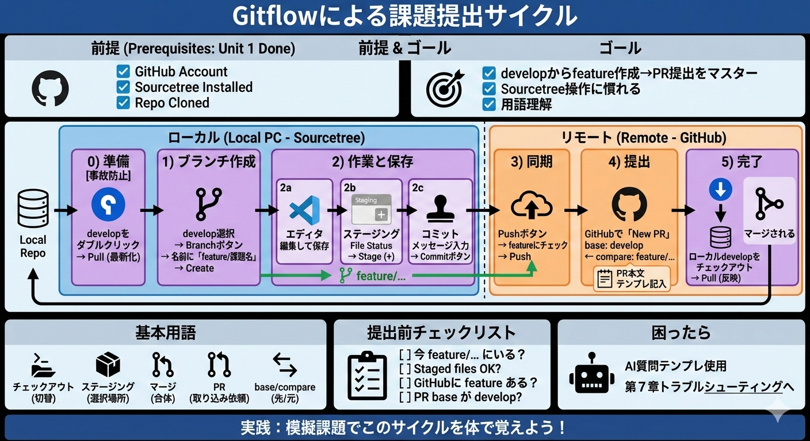

# Gitflowによる課題提出サイクル



**この章の前提**：Unit 1「環境構築」が完了していること
- GitHub アカウントを作成済み
- Sourcetree をインストール済み
- リポジトリをクローン済み

まだの場合は、先に Unit 1 を完了してから戻ってきてください。

提出ブランチ：`feature/02-task-submission-cycle`（PRのbase：`develop`）

## 1. この章のゴール
- `develop` から `feature/課題名` を作り、課題提出（PR）までを一通りできる。
- 「どこをクリックするか」を見ながら、Sourcetree で迷わず操作できる。
- 専門用語（ブランチ、マージ、インデックスなど）を自分の言葉で説明できる。

## 2. 初登場の用語（ここだけ押さえればOK）
- **チェックアウト（checkout）**：そのブランチに切り替えること（「今いる作業台を変える」）。
- **ステージング（index）**：コミットに入れる変更を選ぶ場所。
- **マージ（merge）**：別ブランチの変更を取り込んで合体すること。
- **PR（Pull Request）**：`feature` の変更を `develop` に取り込んでください、という提出物。
- **base / compare**：PR の「取り込み先 / 提出元」（この運用では base=`develop`）。

## 3. 実践：課題提出の5ステップ（Sourcetree中心）
※ ここでは `feature/02-submit-practice` を例にしています。実際の課題では `feature/課題名` に置き換えてください。

### 0) 作業前の準備（事故防止）
- Sourcetree のブランチ一覧で `develop` をダブルクリック（チェックアウト）
- 上部の `Pull` をクリック（最新化）

※ `develop` が見当たらない場合は、先に `main` から `develop` を作って `Push` します（この章の「模擬課題0」を参照）。

目印：
- `develop` は Sourcetree 左の `Branches` に出ます（太字/チェックが付いたら “今いるブランチ”）
- `Pull` は Sourcetree 上部のツールバーにあります

### 1) ブランチ作成：`develop` → `feature/02-submit-practice`
- `develop` を選んだ状態で、上部の `Branch` をクリック
- ブランチ名に `feature/02-submit-practice` を入力
- `Checkout new branch` にチェック（作成後に切り替える）
- `Create Branch` / `OK`

目印：`Branch` を押すと「新しいブランチ」ダイアログが出ます。`Branch name` の入力欄と `Checkout new branch` のチェックを確認します。

### 2) 作業と保存：エディタで編集 → ステージング → コミット
**お使いのエディタ（例：VS Code）で編集**
- ファイルを編集して `保存`（ここで「変更」が発生します）

**Sourcetree（ステージング→コミット）**
- `File Status` を開く
- `Unstaged files` に出ているファイルをクリックして差分を確認
- 右側の `Stage`（＋/チェック）を押して `Staged files` に移す
- コミットメッセージを書く（例：`02-submit-practice: READMEに自己紹介を追加`）
- `Commit` をクリック

目印：`File Status` 画面に `Unstaged files / Staged files` があり、コミットメッセージ入力欄が上部に出ます。

### 3) 同期：GitHubへプッシュ
- 上部の `Push` をクリック
- `feature/02-submit-practice` にチェックが入っていることを確認
- `Push` をクリック

目印：`Push` ダイアログで "送るブランチ" にチェックを入れます（`feature/02-submit-practice` が正しいか必ず確認）。

### 4) 提出：GitHubで `feature` → `develop` のPull Requestを作る
- GitHubでリポジトリを開く
- 上部の `Pull requests` をクリック
- `New pull request` をクリック
- `base` を **develop** にする（取り込み先）
- `compare` を **feature/02-submit-practice** にする（提出元）
- `Create pull request` をクリック

※ `develop` が選べない場合は、GitHub 側に `develop` がまだ無い可能性があります。`develop` を `Push` してから再度試してください。

目印：PR作成画面の上部に `base`（取り込み先）と `compare`（提出元）のドロップダウンがあります（左が base、右が compare）。

**PR本文テンプレ（そのまま使ってOK）**
```md
## 目的
（例）課題1の提出のため、READMEに自己紹介を追加しました。

## 変更点
- （例）README.md に自己紹介を追記

## 確認方法
README.md を開き、自己紹介が表示されることを確認してください。
```

### 5) 完了：マージ後、ローカル`develop`にプルで反映
PR がマージされたら、あなたの PC 側（ローカル）も最新にします。

- Sourcetree で `develop` をチェックアウト
- 上部の `Pull` をクリック

（余裕があれば）後片付け：
- `feature/02-submit-practice` を右クリック → `Delete`（ローカルブランチ削除）

目印：左の `develop` をダブルクリックで切り替えたあと、上部ツールバーの `Pull` を押します。

## 4. 提出前チェックリスト（不安なときはこれだけ）
- [ ] 今いるブランチが `feature/...` になっている（`develop` や `main` ではない）
- [ ] `Staged files` に「入れてよい変更だけ」入っている
- [ ] プッシュ済みで、GitHub に `feature/...` ブランチが見える
- [ ] PR の base が `develop` になっている

## 5. つまずいたら
- `main` で作業してしまった／プッシュできない／コンフリクトが出た → 第7章「トラブルシューティング（詰まったらここ）」へ

## 6. 模擬課題（このカリキュラム内で“提出まで完走”する）
この章は「読む」だけではなく、**実際に PR 提出までやって**体で覚えるのが一番強いです。  
ここでは練習用リポジトリ（第1章で作った `git-learning` など）を使って進めます。

### 模擬課題0：セットアップ確認（15分）
**やること**
- Sourcetree で練習用リポジトリを開く
- `develop` が無ければ作成して `Push`（GitHub にも `develop` を作る）
- `develop` をチェックアウトして `Pull` ができることを確認

**合格条件**
- `origin/develop` が GitHub に存在する
- Sourcetree で `main` と `develop` が見える

**提出物（メンターに出すなら）**
- GitHub の `develop` ブランチURL（URLに `/tree/develop` が含まれていればOK）
- Sourcetree で「今いるブランチ」が `develop` になっていること（ブランチ名を文字で報告）

### 模擬課題1：課題提出リハーサル（PR→マージ→Pull）
**ゴール**：`feature/02-submit-practice` から `develop` に PR を出し、マージ後にローカル `develop` へ反映できる。

**やること**
1. `develop` をチェックアウト → `Pull`
2. `develop` から `feature/02-submit-practice` を作成
3. お使いのエディタ（例：VS Code）で `README.md` に「自己紹介」か「学習メモ」を追記して保存
4. Sourcetree でステージング → コミット（例：`02-submit-practice: READMEに自己紹介を追加`）
5. `Push`（`feature/02-submit-practice` を GitHub へ）
6. GitHub で PR を作成（base=`develop`、compare=`feature/02-submit-practice`）
7. PR テンプレの空欄を埋めて提出
8. PR をマージ（授業ルールに従う：メンターがマージする場合は待つ）
9. ローカルで `develop` をチェックアウト → `Pull`（マージ結果を取り込む）

**合格条件**
- PR の base が `develop`、compare が `feature/02-submit-practice`
- PR 本文に「目的・変更点・確認方法」が書けている
- マージ後、ローカル `develop` の `History` にマージ結果が見える

**提出物（メンターに出すなら）**
- PR のURL
- PR が `Merged` になっていること（PR画面の `Merged` 表示を確認）
- ローカル `develop` の最新コミットメッセージ（Sourcetree `History` の一番上を1行で報告）

## 7. AIに質問するテンプレ
AIは今開いているページを自動で把握しています。状況だけ伝えればOKです。

```md
やりたいこと：（例）feature/02-submit-practiceからdevelopへPR提出したい
今いるブランチ：（Sourcetreeで太字/チェックのブランチ名）
詰まっているステップ：（0〜5のどこか。例：3) Push）
起きていること：（例）PRのbaseが選べない / Pushで失敗する
エラー全文：（あればそのまま）
```

### 具体例（このまま質問してOK）
```text
「いま `1) ブランチ作成` です。`develop` を選んで `Branch` を押した後、どこに `feature/課題名` を入れる？チェックすべき項目も教えて」
「いま `4) PR作成` です。表示されている base/compare は `base=___` / `compare=___`。正しい？間違っていたらどこを直す？」
「模擬課題1のPR本文を作って。目的/変更点/確認方法に分けて、初心者でも短く分かる文章にして」
```

---

## 課題提出

この章には提出課題があります。

1. 上記のハンズオン課題を完了する
2. GitHub で `feature/02-task-submission-cycle` ブランチを作成し、PRを作成
3. [AI総合レビューツール](https://ai.studio/apps/drive/1AMqIqU4Bio4te7AWh5dly1Qzp7CesqP9?fullscreenApplet=true) でレビューを実行
4. 問題がなければ、スプレッドシートに **PR URL** と **完了日** を記入
